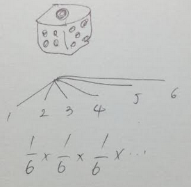

# 5-trie-examples

[日本語](https://github.com/growingspaghetti/5-trie-examples#日本語)

I'm developing a dictionary app and wanted to add prefix-search functionality to it. [my dictionary app](https://github.com/growingspaghetti/websters-1913-console-dictionary)

This repository has got 5 elementary implementations of trie. Their differences would contribute to your understanding of how the data structure evolved.

[1. playground](https://play.golang.org/p/86YVjSknIj4)
```bash
go run object/*
go test object/*
```

[2. playground](https://play.golang.org/p/jluCmviHRY-)
```bash
go run table/*
go test table/*
```

[3. playground](https://play.golang.org/p/9hioUJklb8g)
```bash
go run array/*
go test array/*
```

[4. playground](https://play.golang.org/p/cYbt1pA3E0Q)
```bash
go run triple/*
go test triple/*
```

[5. playground](https://play.golang.org/p/Ti1XiNk5L1I)
```bash
go run double/*
go test double/*
```

# background

For example, you've got dictionary data saved in SQLite:

| category | word | meaning |
|:--:|:--|:--|
|1|bbc|British Broadcasting Service|
|2|cbc|Canadian Broadcasting Service|
|2|cbc|Cipher Block Chaining|
|3|cc|carbon copy|

If a user pressed `c`,  I'd like to run either
```sql
SELECT * FROM dict WHERE word LIKE 'c%'
SELECT * FROM dict WHERE category IN (2, 3)
```

Because WordNet and Webster's dictionary have 100 thousands of entries, I'd like to avoid building a trie tree in runtime.

```rust
struct Node {
    children: [Option<Box<Node>>; 27],
    id: u32,
}
```

However, since a tree is a recursive structure, its depth is arbitrary so that the content needs to be escaped to the heap space for the compiler to determine the size of an entire structure. This trie structure is dynamic and cannot be built at the compilation time.

# 1. object-based trie


It's like the XML DOM and the directory structure.

```xml
<root>
  <b>
    <b>
      <c/>
    </b>
  </b>
```
```
└── 12 probability
    ├── 01
    │   ├── 01
    │   │   ├── pg_0328-000_0002.jpg
    │   │   ├── pg_0328-000_0003.jpg
    │   │   ├── pg_0329-000_0000.jpg
    │   │   └── pg_0329-000_0001.jpg
    │   └── pg_0328-000_0001.jpg
    └── 02
        ├── 01
        │   ├── pg_0329-000_0003.jpg
        │   ├── pg_0330-000_0000.jpg
        │   ├── pg_0330-000_0001.jpg
```
[this structure was used for building htmls](https://github.com/growingspaghetti/1300-math-formulas-alex-svirin-anki-deck/blob/main/Main.java#L94)

One thing I had to recall was the order to pile the stack for this depth-first search.

```go
for i := len(parent.Children) - 1; i >= 0; i-- {
    stack.push(&parent.Children[i])
}
```


# 2. sparse-table trie



The probability you get six for three times in a row is
```
1/6 * 1/6 * 1/6 = 1 event / 216 events
```


Each trial can be piled up in a table as a row. Rows are connected via pointers in cells. As for a dice, a trial has 6 branches.

```go
type trie struct {
	Nodes      [][]node
	nOfLetters int
```

```go
type node struct {
	OffspringRow *int
```


The main disadvantage is that information is so sparse, especially when it's got a lot of columns.

## 3. serializing table into a single array


It's not a big deal to slice a table by row, splice them and make a concatenated single line of data.


One tricky thing was that `append()` silently created dangling pointers. [doc.rust-lang.org](https://doc.rust-lang.org/nomicon/ownership.html) 

# shortening the array

The meaning of the serializing procedure above is, addition of a six-space padding for each row.

By adjusting this padding instead of giving a fixed-size of it, we can shrink the data size.

Triple-array trie and double-array trie were implemented as a conversion from the product of #3.

## 4. triple-array trie

```javascript
{
  "Nodes": [
    {},
    {
      "OffspringRow": 3,
      "Debug": "b",
      "Check": -1
    },
    {
      "OffspringRow": 12,
      "Debug": "c",
      "Check": -1
    },
    {
      "OffspringRow": 6,
      "Debug": "b",
      "Check": 1
    },
    {
      "OffspringRow": 9,
      "Id": 1,
      "Debug": "c",
      "Check": 4
    },
    {
      "OffspringRow": 15,
      "Debug": "b",
      "Check": 2
    },
    {
      "OffspringRow": 21,
      "Id": 3,
      "Debug": "c",
      "Check": 2
    },
    {
      "OffspringRow": 18,
      "Id": 2,
      "Debug": "c",
      "Check": 13
    }
  ],
  "Base": [
    0,
    2,
    0,
    0,
    2,
    1,
    0,
    0
  ]
}
```

Base contains the paddings.

The pointers in the cells stay the same.

For example, `"OffspringRow": 15,` means the row #5 for abc; and the current row number can be recovered by accumulating the paddings up to 5: 0+2+0+0+2=4.

However, the row #4 `{"Debug": "b", "Check": 1}` says its caller cell, Check, was 1. b→a is not the case. In this example, it's obvious as it's got `Debug` though.

 - root node was denoted as -1 as a caller
 - from here, stack needs the position of the parent in the table in order to verify if it's eligible to call children.
    ```go
  	stack.push(n, order)
	for !stack.isEmpty() {
		parent, ord := stack.pop()
		r := int(*parent.OffspringRow)
		base := t.accumBase(r / t.nOfLetters)
		for i := t.nOfLetters - 1; i >= 0; i-- {
			dest := base + i
			node := &t.Nodes[dest]
			if *node.Check != ord {
				continue
			}
			stack.push(node, r+i)
    ```

## 5. double-array trie

```javascript
{
  "Nodes": [
    {},
    {
      "OffspringRow": 3,
      "Debug": "b",
      "Check": -1
    },
    {
      "OffspringRow": 6,
      "Debug": "c",
      "Check": -1
    },
    {
      "OffspringRow": 0,
      "Id": 1,
      "Debug": "c",
      "Check": 4
    },
    {
      "OffspringRow": 1,
      "Debug": "b",
      "Check": 1
    },
    {
      "OffspringRow": 0,
      "Id": 2,
      "Debug": "c",
      "Check": 7
    },
    {},
    {
      "OffspringRow": 3,
      "Debug": "b",
      "Check": 2
    },
    {
      "OffspringRow": 0,
      "Id": 3,
      "Debug": "c",
      "Check": 2
    }
  ]
}
```
Vestiges of the table were completely removed. Row information is based on the rows of the current array. Checks and pointers were updated correspondingly.

```go
for i := 0; i < len(t.Nodes); i++ {
    n := &t.Nodes[i]
    if n.OffspringRow != nil {
        p := positionMap[*n.OffspringRow]
        n.OffspringRow = &p
    }
    if n.Check != nil {
        shift := *n.Check % t.nOfLetters
        p := positionMap[*n.Check-shift]
        c := p + shift
        n.Check = &c
    }
}
```
In my implementation, I used a hashmap to map those old values into new ones. It walked through cells to collect information to build the hashmap first, then again walked them through to perform the updates.

---

# 日本語


辞書ソフトを作っており、前方一致検索機能を付けたかった [辞書ソフト](https://github.com/growingspaghetti/websters-1913-console-dictionary)

このレポジトリにはトライ木の基礎的な実装が5つあり、その違いがこのデータ構造の進化の理解に役立てばと思っています。


[1. playground](https://play.golang.org/p/86YVjSknIj4)
```bash
go run object/*
go test object/*
```

[2. playground](https://play.golang.org/p/jluCmviHRY-)
```bash
go run table/*
go test table/*
```

[3. playground](https://play.golang.org/p/9hioUJklb8g)
```bash
go run array/*
go test array/*
```

[4. playground](https://play.golang.org/p/cYbt1pA3E0Q)
```bash
go run triple/*
go test triple/*
```

[5. playground](https://play.golang.org/p/Ti1XiNk5L1I)
```bash
go run double/*
go test double/*
```

# 背景

SQLiteに以下に掲げるような辞書データが入っているとすると、

| category | word | meaning |
|:--:|:--|:--|
|1|bbc|British Broadcasting Service|
|2|cbc|Canadian Broadcasting Service|
|2|cbc|Cipher Block Chaining|
|3|cc|carbon copy|

`c`が押されたら、この手のSQL文を発行したいわけです
```sql
SELECT * FROM dict WHERE word LIKE 'c%'
SELECT * FROM dict WHERE category IN (2, 3)
```

WordNetやWebster'sの辞書はそれぞれ10万以上の項目があるので、ソフトの開始時に木構造を構築するというのは避けたいところです。

```rust
struct Node {
    children: [Option<Box<Node>>; 27],
    id: u32,
}
```

しかし、木構造が再帰的になるので、然るにその深さが未知数で、結果、構造体のtypeサイズが不明であるとコンパイラに怒られるわけです。仕方なくBoxを使って中身をヒープに逃がすと、これはこれで動的メモリ確保ですから、やっぱり実行可能バイナリに木を固めて書き込んでしまえないのです。

# 1. オブジェクト関係ツリーのトライ木


ディレクトリ構造とかXMLのDOMとか、再帰構造よろしく

```xml
<root>
  <b>
    <b>
      <c/>
    </b>
  </b>
```
```
└── 12 probability
    ├── 01
    │   ├── 01
    │   │   ├── pg_0328-000_0002.jpg
    │   │   ├── pg_0328-000_0003.jpg
    │   │   ├── pg_0329-000_0000.jpg
    │   │   └── pg_0329-000_0001.jpg
    │   └── pg_0328-000_0001.jpg
    └── 02
        ├── 01
        │   ├── pg_0329-000_0003.jpg
        │   ├── pg_0330-000_0000.jpg
        │   ├── pg_0330-000_0001.jpg
```
[このディレクトリ構造は、HTMLファイルを秩序だって構築するのに、実際この前使いました](https://github.com/growingspaghetti/1300-math-formulas-alex-svirin-anki-deck/blob/main/Main.java#L94)

この実装でひとつ思い出したのは、深さ優先検索なので、スタックに積むのが逆順になることでした。

```go
for i := len(parent.Children) - 1; i >= 0; i-- {
    stack.push(&parent.Children[i])
}
```


# 2. 空きの多いテーブル実装


3回連続で6がでる確率は、事象1回/216回である。
```
1/6 * 1/6 * 1/6 = 1 event / 216 events
```


サイコロで言うところ、それぞれの試行は6パターンの結果がある。そんな風な調子で、1回試行するごとにそれを行としてテーブルに重ねていけば、ツリーは表として表せる。セル内にポインターを持たせることで、行と行の繋がりを表現している。

```go
type trie struct {
	Nodes      [][]node
	nOfLetters int
```

```go
type node struct {
	OffspringRow *int
```


欠点はやたら空隙が多くなる。とりわけ、赤玉とか白玉とか1から6のマス目とかから、アルファベット27文字とか選択肢が増えたときに顕著になる。

## 3. 表を構成する行を水平に並べる


長方形を一行に並べることは、とくに造作ない。


`append()` が密かにダングリングポインタを作っていたのははまりどころだった。 [doc.rust-lang.org](https://doc.rust-lang.org/nomicon/ownership.html) 

# 行を縮める

上の直列化の操作は、言ってみれば、6セル分のパディングを反復的にかけたことに等しい。

このパディングを調整しながら結合すれば、空きを減らせる。

ここでは、ダブル配列、トリプル配列の両方とも、上の直鎖データを変換することで作った。

## 4. トリプル配列

```javascript
{
  "Nodes": [
    {},
    {
      "OffspringRow": 3,
      "Debug": "b",
      "Check": -1
    },
    {
      "OffspringRow": 12,
      "Debug": "c",
      "Check": -1
    },
    {
      "OffspringRow": 6,
      "Debug": "b",
      "Check": 1
    },
    {
      "OffspringRow": 9,
      "Id": 1,
      "Debug": "c",
      "Check": 4
    },
    {
      "OffspringRow": 15,
      "Debug": "b",
      "Check": 2
    },
    {
      "OffspringRow": 21,
      "Id": 3,
      "Debug": "c",
      "Check": 2
    },
    {
      "OffspringRow": 18,
      "Id": 2,
      "Debug": "c",
      "Check": 13
    }
  ],
  "Base": [
    0,
    2,
    0,
    0,
    2,
    1,
    0,
    0
  ]
}
```

Base配列が例のパディングを含んでいる。

セルに含まれているポインタの値は変えていない。

例えば、"OffspringRow": 15,` 行き先にセル番15とあったとして、このabcの3パターンしかない例では5行目のことなので、パディングを5行目分まで加算していくと、現時点でのセル番が復元できる。0+2+0+0+2=4である。

もっとも、セル4には`{"Debug": "b", "Check": 1}` 呼び出し元、すなわちCheckが1番目のセルと書いてあり、b→aにはならないと分かる。もっとも、この例では、`Debug`のフィールドがあって、bって書いてるのでaと読めないのは明らかなのですが。

 - ルートノードは-1とした
 - ここから、Stackは呼び出し元の位置情報を必要とする。下位選択肢を上が呼ぶのが有効かどうかがこれでCheckされる。
    ```go
  	stack.push(n, order)
	for !stack.isEmpty() {
		parent, ord := stack.pop()
		r := int(*parent.OffspringRow)
		base := t.accumBase(r / t.nOfLetters)
		for i := t.nOfLetters - 1; i >= 0; i-- {
			dest := base + i
			node := &t.Nodes[dest]
			if *node.Check != ord {
				continue
			}
			stack.push(node, r+i)
    ```

## 5. ダブル配列

```javascript
{
  "Nodes": [
    {},
    {
      "OffspringRow": 3,
      "Debug": "b",
      "Check": -1
    },
    {
      "OffspringRow": 6,
      "Debug": "c",
      "Check": -1
    },
    {
      "OffspringRow": 0,
      "Id": 1,
      "Debug": "c",
      "Check": 4
    },
    {
      "OffspringRow": 1,
      "Debug": "b",
      "Check": 1
    },
    {
      "OffspringRow": 0,
      "Id": 2,
      "Debug": "c",
      "Check": 7
    },
    {},
    {
      "OffspringRow": 3,
      "Debug": "b",
      "Check": 2
    },
    {
      "OffspringRow": 0,
      "Id": 3,
      "Debug": "c",
      "Check": 2
    }
  ]
}
```
テーブルであった痕跡を完全に取り除いた。行番号は今現在の配列のそれに基づいている。呼び出し元のセル番を書いているチェック番号とセルが指している子の位置情報もそれぞれアップデートされている。

```go
for i := 0; i < len(t.Nodes); i++ {
    n := &t.Nodes[i]
    if n.OffspringRow != nil {
        p := positionMap[*n.OffspringRow]
        n.OffspringRow = &p
    }
    if n.Check != nil {
        shift := *n.Check % t.nOfLetters
        p := positionMap[*n.Check-shift]
        c := p + shift
        n.Check = &c
    }
}
```
私の実装では、古い値から新しい値に置換するのにハッシュマップを使った。一度全てのノードを走査して必要な情報を集め、もう一度走査して必要箇所に置換をかけている。
